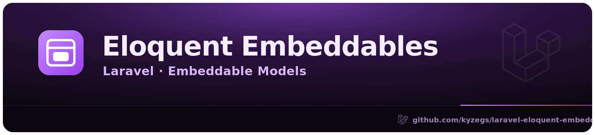

# Laravel Eloquent Embeddables

Doctrine-like **embeddables** for Eloquent, built on Laravel's native custom cast system.

Group several plain database columns into a rich PHP value object — no JSON column, no extra table, and no trait required on the parent model.

```php
$user->address->street;
$user->address->city = 'Rotterdam';
$user->save();
```

…while the database keeps ordinary columns:

```
users.address_street
users.address_city
users.address_postal_code
users.address_country
```

## Mental model

> Laravel custom casts, but powerful enough to behave like Doctrine embeddables.

An embeddable owns **structure, casting, validation and clean object access**. The parent model owns **persistence**. The embeddable has no table, no identity, and is never saved on its own — it is persisted only through its parent.

## Requirements

- PHP 8.2+ (Laravel 13 requires PHP 8.3+)
- Laravel 12 or 13

## Installation

```bash
composer require kyzegs/eloquent-embeddables
```

## Defining an embeddable

Extend `EmbeddableModel`. It reuses Eloquent's attribute machinery (fillable/guarded, casts, accessors, mutators, hidden, visible, appends, `toArray()`/`toJson()`, default attributes) but refuses every persistence and relationship method.

```php
use Kyzegs\EloquentEmbeddables\EmbeddableModel;

final class Address extends EmbeddableModel
{
    protected $fillable = [
        'street',
        'city',
        'postal_code',
        'country',
    ];

    protected function casts(): array
    {
        return [
            'verified' => 'boolean',
        ];
    }

    public function fullAddress(): string
    {
        return trim("{$this->street}, {$this->postal_code} {$this->city}, {$this->country}");
    }
}
```

## Using it in a parent model

Add the cast to the parent's `casts()` method. **No trait is required.**

### Zero-config form

```php
use Illuminate\Database\Eloquent\Model;
use Kyzegs\EloquentEmbeddables\Casts\EmbeddableCast;

final class User extends Model
{
    protected function casts(): array
    {
        return [
            'address' => EmbeddableCast::using(Address::class, nullable: true),
        ];
    }
}
```

The prefix defaults to the cast key + `_` (`address_`), and the columns are discovered by matching that prefix against the parent table's real columns (one cached schema query per table). No columns match, or no connection is available? The map falls back to the embeddable's fillable attributes and cast keys, prefixed.

The full resolution order, most explicit first:

1. An explicit `columns` map.
2. Explicit `attributes`, prefixed.
3. Schema discovery: parent table columns matching the prefix.
4. Fallback: the embeddable's fillable attributes + cast keys, prefixed.

If none of these produce a map, an `InvalidArgumentException` explains exactly what was tried. Combining `columns` with `prefix`/`attributes` throws as well — the forms are mutually exclusive.

### Prefix form

```php
use Illuminate\Database\Eloquent\Model;
use Kyzegs\EloquentEmbeddables\Casts\EmbeddableCast;

final class User extends Model
{
    protected function casts(): array
    {
        return [
            'address' => EmbeddableCast::using(
                Address::class,
                prefix: 'address_',
                attributes: ['street', 'city', 'postal_code', 'country', 'verified'],
                nullable: true,
            ),
        ];
    }
}
```

Maps:

```
address.street       => address_street
address.city         => address_city
address.postal_code  => address_postal_code
address.country      => address_country
address.verified     => address_verified
```

### Explicit column-map form

```php
'address' => EmbeddableCast::using(
    Address::class,
    columns: [
        'street'      => 'address_street',
        'city'        => 'address_city',
        'postal_code' => 'address_postal_code',
        'country'     => 'address_country',
    ],
    nullable: true,
),
```

## Working with embeddables

**Read** like an object:

```php
$user = User::first();

echo $user->address->city;
echo $user->address->fullAddress();
echo $user->address->verified; // true (cast applied)
```

**Assign an array:**

```php
$user->address = [
    'street' => 'Coolsingel 1',
    'city' => 'Rotterdam',
    'postal_code' => '3012 AA',
    'country' => 'NL',
];

$user->save();
```

**Assign an instance:**

```php
$user->address = new Address([
    'street' => 'Coolsingel 1',
    'city' => 'Rotterdam',
]);

$user->save();
```

**Mutate in place** — changes are synced back to the parent columns on save:

```php
$user->address->city = 'Amsterdam';
$user->save();   // updates users.address_city
```

**Compare as value objects** — `equals()` is true for the same concrete class with identical attributes, regardless of order:

```php
$user->address->equals(new Address(['city' => 'Rotterdam', /* … */]));
```

## Nullable embeddables

With `nullable: true`:

```php
$user->address = null;
$user->save();   // sets every mapped column to null
```

When reading, if **all** mapped columns are `null`, the cast returns `null` instead of an empty embeddable.

## Serialization

Use the optional `HasEmbeddables` trait on the parent to expose a clean nested object in `toArray()` / `toJson()`. It appends each embeddable and hides its backing columns:

```php
use Illuminate\Database\Eloquent\Model;
use Kyzegs\EloquentEmbeddables\Concerns\HasEmbeddables;

final class User extends Model
{
    use HasEmbeddables;

    // ...casts() as above
}
```

```php
[
    'id' => 1,
    'name' => 'Sebastiaan',
    'address' => [
        'street' => 'Coolsingel 1',
        'city' => 'Rotterdam',
        'postal_code' => '3012 AA',
        'country' => 'NL',
        'verified' => true,
    ],
]
```

Without the trait, casts/reads/writes still work — the model just serializes the flat columns instead of a nested object.

## Querying

Embeddables are plain columns, so query the parent model normally:

```php
User::where('address_city', 'Rotterdam')->get();
```

## IDE support (laravel-ide-helper)

[barryvdh/laravel-ide-helper](https://github.com/barryvdh/laravel-ide-helper) works out of the box: `ide-helper:models` resolves the cast through `EmbeddableCast::get()` and annotates every embeddable as the generic `EmbeddableModel|null`.

For the concrete class and correct nullability, register the shipped model hook in `config/ide-helper.php`:

```php
'model_hooks' => [
    \Kyzegs\EloquentEmbeddables\IdeHelper\EmbeddablesModelHook::class,
],
```

`ide-helper:models` then generates:

```php
/**
 * @property \App\ValueObjects\Address|null $address
 */
```

The `|null` is only added when the cast is `nullable`. (The write side also accepts an attribute array or `null`; the generated single-type `@property` favors the concrete class.)

The hook also types the embeddable classes themselves. An embeddable has no table to introspect, so the hook finds a parent model embedding it (scanning ide-helper's `model_locations`), maps each attribute to its backing parent column, and derives the type from the embeddable's own cast or the column's schema type:

```php
/**
 * @property string|null $street
 * @property string|null $city
 * @property bool|null $verified
 */
class Address extends EmbeddableModel
```

Make sure both the parent models and the embeddable classes live in directories covered by `model_locations` in `config/ide-helper.php`. When several parents embed the same class, the first one found supplies the column types.

## What is *not* supported

An embeddable is not a full Eloquent model. Every persistence method (`save`, `saveOrFail`, `update`, `delete`, `forceDelete`, `push`, `refresh`, `fresh`, `touch`, `increment`, `decrement` and their quiet variants) and every relationship method (`hasOne`, `hasMany`, `hasOneThrough`, `hasManyThrough`, `through`, `belongsTo`, `belongsToMany`, `morphOne`, `morphMany`, `morphTo`, `morphToMany`, `morphedByMany`) throws an `EmbeddableException`:

```php
$user->address->save();
$user->address->delete();
$user->address->hasMany(...);
```

> Embeddables are persisted through their parent Eloquent model. Call save() on the parent model instead.

> Embeddables do not participate in relationships. Define the relationship on the parent Eloquent model instead.

## How it works

`EmbeddableCast::using()` returns an encoded [`Castable`](https://laravel.com/docs/eloquent-mutators#castables) definition, so Laravel's native cast resolver builds the configured cast. The attribute => column map is resolved lazily on first use, following the resolution order above. On the cast:

1. **`get()`** reads the mapped parent columns and hydrates an embeddable (its own casts apply).
2. **`set()`** flattens an array / instance / `null` back into the mapped columns.
3. Because Eloquent re-invokes `set()` for cached cast objects during `save()`, **direct mutations are synced** to the parent automatically.
4. **`serialize()`** renders the embeddable as a nested array for `toArray()`/`toJson()`.

## Testing

```bash
composer test
```

## License

MIT.
